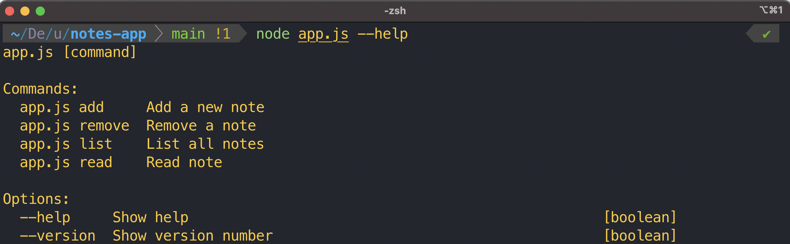

<h1>Node Notes App</h1>

A command line note taking app. Will create a local JSON file to store notes. See screenshot for commands. Required arguments include --title and --body depending on the command run.

